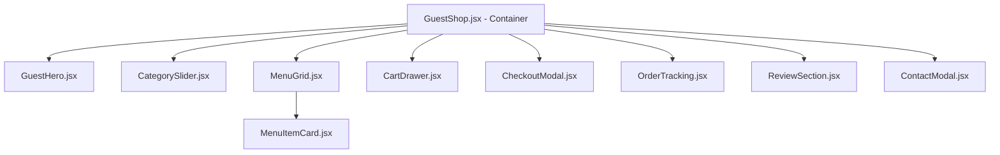

# PRODUCT REQUIREMENTS DOCUMENT (PRD) - REFAKTORING & RESTRUKTURISASI GUEST SHOP
## ☕ HALAMAN GUEST SHOP YANG RAPI, MODULAR, DAN TERSTRUKTUR

Dokumen ini ditulis sebagai panduan teknis bagi **AI Coding Agent** untuk memecah file monolitik `GuestShop.jsx` yang berukuran besar (>80KB, 1900+ baris) menjadi struktur komponen React yang bersih, mudah dipelihara, dan optimal dalam performa *rendering*.

---

## 1. LATAR BELAKANG & TUJUAN REFAKTORING

### Masalah Utama Saat Ini:
*   **Monolitik**: File `GuestShop.jsx` menangani terlalu banyak urusan (*separation of concerns* yang lemah): rendering struktur dasar, state keranjang belanja, form checkout, pelacakan pesanan (order tracking), submit review, toggle favorit, promo kupon, hingga kontak sosial.
*   **Performa & Re-rendering**: Setiap kali item keranjang berubah atau pengguna mengetik di form checkout, seluruh halaman guest shop (termasuk daftar menu yang besar) dipaksa untuk me-render ulang.
*   **Keterbacaan Rendah**: Navigasi kode sepanjang 1900 baris menyulitkan pemeliharaan dan debugging jika terjadi kendala pada salah satu fitur spesifik.

### Tujuan Refaktoring:
*   Membagi kode menjadi sub-komponen kecil yang terfokus (*single responsibility principle*).
*   Menjaga **konsistensi UI** (tidak mengubah tampilan luar, warna, animasi, atau gaya Tailwind CSS & Shadcn UI yang sudah ada).
*   Membuat file `GuestShop.jsx` sebagai *Container Component* (Orkestrator State) utama, sementara bagian tampilan dipindahkan ke *Presentational Components* di dalam folder `components/` lokal.
*   Menyederhanakan alur pengiriman data menggunakan Props & Callback.

---

## 2. STRUKTUR MAP BARU (FOLDER HIERARCHY)

Komponen-komponen spesifik halaman guest akan ditempatkan di dalam folder khusus halaman tersebut untuk menjaga kerapian struktur proyek:

```
src/pages/guest/
├── GuestShop.jsx                 # Main Container (State Orchestrator)
└── components/                   # Sub-komponen modular khusus Guest
    ├── GuestHero.jsx             # Banner Header & Pencarian
    ├── CategorySlider.jsx        # Kategori Slider & Filter
    ├── MenuGrid.jsx              # Grid Pembungkus & Filter Menu
    ├── MenuItemCard.jsx          # Kartu Menu & Tombol Beli/Favorit
    ├── CartDrawer.jsx            # Panel Keranjang Samping (Sidebar)
    ├── CheckoutModal.jsx         # Modal Pengisian Checkout & Kredensial
    ├── OrderTracking.jsx         # Panel Pelacakan Status Pesanan
    ├── ReviewSection.jsx         # List Review & Form Ulasan Pelanggan
    └── ContactModal.jsx          # Dialog Kontak Sosial
```

---

## 3. SPESIFIKASI DAN TUGAS MASING-MASING KOMPONEN

### A. `GuestShop.jsx` (Main Container Component)
*   **Tanggung Jawab**:
    *   Memuat data dari Supabase via helper `src/lib/db.js` (`getMenuItems`, `getCategories`).
    *   Mengatur global state: `cart` (keranjang), `favorites` (daftar favorit), `appliedPromo` (kupon yang diterapkan), `reviews` (ulasan lokal/DB).
    *   Menangani logika callback penting seperti `handleAddToCart()`, `handleQuantityChange()`, `handleApplyPromo()`, `handleCheckoutSubmit()`, dan `handleTrackOrder()`.
*   **Output**: Mengkoordinasikan sub-komponen presentasional dan mendistribusikan data melalui props.

### B. `GuestHero.jsx`
*   **Props**: `searchQuery`, `setSearchQuery`, `onTrackOrderClick`, `onContactClick`
*   **Tanggung Jawab**: 
    *   Menampilkan judul selamat datang, sub-teks bertema kopi, dan tombol pintas (Pelacakan Order & Hubungi Kami).
    *   Menampung input pencarian menu realtime.

### C. `CategorySlider.jsx`
*   **Props**: `categories`, `activeCategory`, `onSelectCategory`
*   **Tanggung Jawab**: 
    *   Menampilkan horizontal slider kategori menu (Hot Coffee, Iced Coffee, Food, dll).
    *   Menerapkan *active state layout* (tombol berwarna penuh jika dipilih, border pudar jika tidak dipilih).

### D. `MenuGrid.jsx` & `MenuItemCard.jsx`
*   **Props (`MenuGrid`)**: `menuItems`, `favorites`, `onAddToCart`, `onToggleFavorite`
*   **Props (`MenuItemCard`)**: `item`, `isFavorite`, `onAddToCart`, `onToggleFavorite`
*   **Tanggung Jawab**:
    *   Memfilter daftar produk berdasarkan teks pencarian dan kategori aktif.
    *   Menampilkan grid responsif.
    *   Setiap kartu produk harus menampilkan gambar, harga, bintang rating, lencana (badge seperti *Popular* / *Best Seller*), serta tombol add-to-cart yang responsif dan tombol hati untuk wishlist.

### E. `CartDrawer.jsx`
*   **Props**: `isOpen`, `onClose`, `cart`, `onUpdateQuantity`, `onRemoveItem`, `onCheckoutClick`, `appliedPromo`, `discountAmount`, `subtotal`, `total`
*   **Tanggung Jawab**:
    *   Menyajikan panel samping (drawer/sheet) yang meluncur dari kanan layar.
    *   Menampilkan detail item di dalam keranjang, tombol penambah/pengurang kuantiti, tombol hapus (tong sampah), serta rincian harga (Subtotal, Diskon Voucher, Pajak PPN 11%, dan Total Akhir).

### F. `CheckoutModal.jsx`
*   **Props**: `isOpen`, `onClose`, `cart`, `subtotal`, `onSubmit`, `appliedPromo`, `onApplyPromo`, `promoError`
*   **Tanggung Jawab**:
    *   Menampilkan form input data pemesanan (Nama Guest, Tipe Layanan [Dine-In/Takeaway], Nomor Meja [jika Dine-In], Metode Pembayaran [Cash, Card, QRIS], dan Catatan Tambahan).
    *   Menyediakan kolom validasi kupon promo (`handleApplyPromo`).
    *   Memproses validasi input sebelum memanggil callback submit pesanan.

### G. `OrderTracking.jsx`
*   **Props**: `isOpen`, `onClose`, `onTrackSubmit`, `trackedOrder`, `loading`, `error`
*   **Tanggung Jawab**:
    *   Menyediakan form untuk memasukkan nomor pesanan (misalnya `ORD-001`).
    *   Menampilkan detail pesanan beserta status terkininya (`pending` ➔ `processing` ➔ `completed` / `cancelled`) dengan indikator garis progres visual yang estetik.

### H. `ReviewSection.jsx`
*   **Props**: `reviews`, `onAddReview`
*   **Tanggung Jawab**:
    *   Menampilkan grid testimoni ulasan pelanggan.
    *   Menampilkan form interaktif untuk menulis ulasan baru (nama, kategori ulasan [Rasa Menu, Pelayanan, Kebersihan], skor rating bintang 1-5, dan kolom komentar).

---

## 4. HIERARKI KOMPONEN (STRUCTURE DIAGRAM)

Hierarki aliran data satu arah (Unidirectional Data Flow) setelah pemecahan komponen digambarkan sebagai berikut:



---

## 5. RENCANA IMPLEMENTASI BERTAHAP

AI Coding Agent harus mematuhi urutan pengerjaan berikut agar refaktoring berjalan aman tanpa merusak fungsi yang sudah ada:

### 📍 LANGKAH 1: Inisialisasi Direktori Komponen Lokal
*   Buat folder baru di path: `src/pages/guest/components/`.
*   Buat file kosong untuk masing-masing komponen: `GuestHero.jsx`, `CategorySlider.jsx`, `MenuItemCard.jsx`, `MenuGrid.jsx`, `CartDrawer.jsx`, `CheckoutModal.jsx`, `OrderTracking.jsx`, `ReviewSection.jsx`, dan `ContactModal.jsx`.

### 📍 LANGKAH 2: Migrasi Komponen Stateless & UI Presentasional
*   Pindahkan blok UI Hero (Header) dari `GuestShop.jsx` ke `GuestHero.jsx`. Hubungkan input pencarian dengan event callback.
*   Pindahkan komponen slider kategori ke `CategorySlider.jsx`. Hubungkan status tombol aktif dengan callback set kriteria kategori.
*   Pindahkan kartu item produk beserta ikon wishlist-nya ke `MenuItemCard.jsx` dan atur susunan grid di `MenuGrid.jsx`.

### 📍 LANGKAH 3: Migrasi Komponen Interaktif & Modal Dialog
*   Pindahkan layout modal form checkout beserta kolom voucher promosi ke `CheckoutModal.jsx`.
*   Pindahkan form tracking order dan visual stepper tracking ke `OrderTracking.jsx`.
*   Pindahkan formulir dan ulasan testimoni ke `ReviewSection.jsx`.
*   Pindahkan tautan kontak ke `ContactModal.jsx`.

### 📍 LANGKAH 4: Pembersihan File Utama `GuestShop.jsx`
*   Hapus kode layout HTML yang telah dipindahkan dari file `GuestShop.jsx`.
*   Impor seluruh sub-komponen baru di bagian atas file `GuestShop.jsx`.
*   Rangkai sub-komponen tersebut di dalam fungsi render `GuestShop.jsx` dengan mengirimkan data state (seperti `cart`, `favorites`, `searchQuery`) dan fungsi pengubah state melalui props.

### 📍 LANGKAH 5: Verifikasi Fungsionalitas (QA Check)
*   **Uji Fitur Utama**:
    1.  Coba lakukan pencarian menu & filter kategori (pastikan daftar menu ter-update).
    2.  Tambahkan item ke keranjang, kurangi kuantiti, tambahkan kuantiti, dan hapus item.
    3.  Buka keranjang, masukkan voucher diskon (misal `WELCOME10`), dan verifikasi perhitungan diskon & total harga.
    4.  Lakukan checkout dengan mengisi data form. Verifikasi pesanan tersimpan di database Supabase (tabel `orders` & `order_items`) dan tampilkan layar sukses.
    5.  Salin nomor order sukses, coba lakukan pelacakan di modal pelacakan, dan pastikan datanya muncul.
    6.  Tulis ulasan baru dan pastikan ulasan bertambah di list testimoni.
