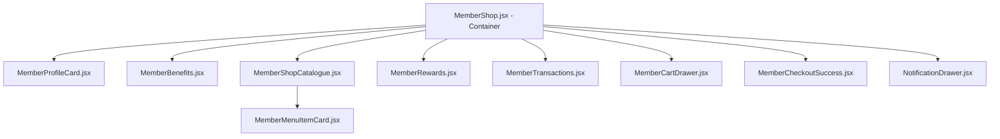

# PRODUCT REQUIREMENTS DOCUMENT (PRD) - REFAKTORING & RESTRUKTURISASI MEMBER SHOP
## ☕ HALAMAN MEMBER SHOP YANG RAPI, MODULAR, DAN TERSTRUKTUR

Dokumen ini ditujukan sebagai panduan teknis bagi **AI Coding Agent** untuk memecah file monolitik `MemberShop.jsx` yang berukuran besar (~69KB, 1690+ baris) menjadi struktur komponen React yang bersih, modular, dan optimal.

---

## 1. LATAR BELAKANG & TUJUAN REFAKTORING

### Masalah Utama Saat Ini:
*   **Monolitik & Multi-Tab**: File `MemberShop.jsx` mengelola tiga modul utama halaman portal member: katalog belanja member (katalog kopi dengan diskon tier otomatis), katalog tukar poin hadiah (rewards), dan riwayat mutasi poin (transaksi).
*   **State Kompleks**: Mengelola state keranjang belanja, voucher promo, kalkulasi estimasi poin belanja baru, panel notifikasi realtime, stepper reward level-up, dan digital membership card (progress bar tier).
*   **Tingkat Rendering Tinggi**: Interaksi apa pun (seperti menambah kuantiti keranjang atau mengetik pencarian) memicu *re-rendering* seluruh halaman portal, termasuk digital card dan daftar reward.

### Tujuan Refaktoring:
*   Memecah kode menjadi sub-komponen presentasional yang kecil dan terfokus.
*   Mempertahankan **100% konsistensi UI** (warna gradien dinamis kartu, badge, tombol, dialog, dan animasi Lucide).
*   Menjadikan `MemberShop.jsx` sebagai *Container Component* (Orkestrator State), sedangkan logika presentasional didistribusikan ke sub-komponen via Props & Callbacks.

---

## 2. STRUKTUR MAP BARU (FOLDER HIERARCHY)

Komponen-komponen spesifik halaman member akan ditempatkan di dalam folder komponen lokal:

```
src/pages/member/
├── MemberShop.jsx                # Main Container (State Orchestrator)
└── components/                   # Sub-komponen modular khusus Member
    ├── MemberProfileCard.jsx     # Kartu Digital Member (Gradien Dinamis & Progress Bar)
    ├── MemberBenefits.jsx        # Panel List Benefit Sesuai Tier Aktif
    ├── MemberShopCatalogue.jsx   # Tab Katalog Belanja (Filter, Search & Grid)
    ├── MemberMenuItemCard.jsx    # Kartu Menu dengan Diskon Tier Otomatis
    ├── MemberRewards.jsx         # Tab Katalog Penukaran Point Reward
    ├── MemberTransactions.jsx    # Tab Riwayat Mutasi Transaksi Poin
    ├── MemberCartDrawer.jsx      # Panel Samping Keranjang (Preview Poin & Diskon Tier)
    ├── MemberCheckoutSuccess.jsx # Modal Sukses Order dengan Point Earned
    └── NotificationDrawer.jsx    # Drawer Panel Notifikasi Member
```

---

## 3. SPESIFIKASI DAN TUGAS MASING-MASING KOMPONEN

### A. `MemberProfileCard.jsx`
*   **Props**: `activeMemberProfile`, `activeUser`, `getNextTierInfo`
*   **Tanggung Jawab**:
    *   Menampilkan kartu keanggotaan digital dengan latar gradien dinamis sesuai level tier.
    *   Menampilkan detail nama, kode member (`MBR-XXXXX`), status aktif/tangguh, dan jumlah poin saat ini.
    *   Menyajikan bar progres interaktif menuju tingkat tier berikutnya beserta sisa poin yang diperlukan.

### B. `MemberBenefits.jsx`
*   **Props**: `activeMemberProfile`
*   **Tanggung Jawab**:
    *   Menampilkan rangkuman daftar benefit khusus dari level tier member yang aktif saat ini (misalnya "Diskon 10% otomatis", "Priority order").

### C. `MemberShopCatalogue.jsx` & `MemberMenuItemCard.jsx`
*   **Props (`MemberShopCatalogue`)**: `categoriesList`, `activeCategory`, `onSelectCategory`, `searchQuery`, `setSearchQuery`, `filteredMenu`, `activeMemberProfile`, `onAddToCart`
*   **Props (`MemberMenuItemCard`)**: `item`, `discountPercent`, `onAddToCart`
*   **Tanggung Jawab**:
    *   Menyediakan tombol filter kategori horizontal dan kolom pencarian menu.
    *   `MemberMenuItemCard` membandingkan harga asli dengan diskon tier member. Menampilkan harga coret (original price) jika diskon aktif (>0%), harga diskon final, serta lencana persentase diskon.

### D. `MemberRewards.jsx`
*   **Props**: `memberRewards`, `activeMemberProfile`, `onRedeemReward`, `SAMPLE_REWARDS`
*   **Tanggung Jawab**:
    *   Menampilkan grid katalog hadiah penukaran poin.
    *   Melakukan pengecekan apakah member memenuhi syarat minimum poin (`current_points >= points_required`) and minimum tier level (`tier_id >= min_tier_id`).
    *   Menampilkan tombol "Klaim Sekarang" jika syarat terpenuhi, atau status "🔒 Terkunci" jika poin/level kurang.

### E. `MemberTransactions.jsx`
*   **Props**: `transactions`
*   **Tanggung Jawab**:
    *   Menampilkan riwayat penambahan poin (tipe `earn` [Belanja]) atau pengurangan poin (tipe `redeem` [Tukar Reward]) dalam format tabel terstruktur, lengkap dengan format tanggal lokal Indonesia.

### F. `MemberCartDrawer.jsx`
*   **Props**: `isOpen`, `onClose`, `cart`, `onUpdateQty`, `onRemoveFromCart`, `activeMemberProfile`, `promoCode`, `setPromoCode`, `onApplyPromo`, `appliedPromo`, `promoError`, `calculations`, `onSubmitCheckout`
*   **Tanggung Jawab**:
    *   Menampilkan sidebar drawer keranjang belanja.
    *   Menampilkan preview kalkulasi dinamis: Subtotal, Diskon Tier Member (Silver/Gold/Platinum), Diskon Voucher Kupon, Estimasi Poin Baru yang akan didapat, dan Total Akhir.
    *   Menyediakan formulir checkout kustom member (Nama, Metode Pembayaran QRIS/Card/Cash, dan Catatan).

### G. `MemberCheckoutSuccess.jsx`
*   **Props**: `checkoutSuccess`, `onClose`
*   **Tanggung Jawab**:
    *   Dialog overlay sukses. Selain menampilkan ID Pesanan dan total biaya, komponen ini wajib menampilkan perolehan koin/poin baru yang berhasil dikumpulkan dari transaksi belanja tersebut.

### H. `NotificationDrawer.jsx`
*   **Props**: `isOpen`, `onClose`, `notifications`
*   **Tanggung Jawab**:
    *   Drawer geser dari kanan untuk menampilkan list notifikasi terbaru (misalnya: order dibuat, order selesai, kenaikan level, atau poin didapat).

---

## 4. HIERARKI ALIRAN DATA KOMPONEN (STRUCTURE DIAGRAM)

Aliran data orkestrasi state portal member digambarkan sebagai berikut:



---

## 5. RENCANA IMPLEMENTASI BERTAHAP

AI Coding Agent harus mematuhi urutan pengerjaan berikut agar refaktoring berjalan aman tanpa merusak fungsi yang sudah ada:

### 📍 LANGKAH 1: Inisialisasi Direktori Komponen Lokal
*   Buat folder baru di path: `src/pages/member/components/`.
*   Buat file kosong untuk masing-masing komponen yang akan diekstrak.

### 📍 LANGKAH 2: Migrasi Komponen Profile & Benefits (Kolom Kiri)
*   Ekstrak kartu digital member ke `MemberProfileCard.jsx`. Pastikan gradien warna Tailwind disuplai secara benar berdasarkan properti `activeMemberProfile.tier.bg_gradient`.
*   Ekstrak daftar benefit tier member ke `MemberBenefits.jsx`.

### 📍 LANGKAH 3: Migrasi Tab Views (Katalog Belanja, Rewards, Transaksi)
*   Pindahkan Tab katalog belanja ke `MemberShopCatalogue.jsx` dan atur integrasi harga coret member di `MemberMenuItemCard.jsx`.
*   Pindahkan logika render penukaran poin ke `MemberRewards.jsx`.
*   Pindahkan tabel mutasi ke `MemberTransactions.jsx`.

### 📍 LANGKAH 4: Migrasi Drawer & Modal
*   Ekstrak layout keranjang, estimasi poin, dan checkout member ke `MemberCartDrawer.jsx`.
*   Ekstrak pop-up sukses belanja ke `MemberCheckoutSuccess.jsx`.
*   Ekstrak dialog notifikasi ke `NotificationDrawer.jsx`.

### 📍 LANGKAH 5: Rakit dan Bersihkan File `MemberShop.jsx`
*   Ganti seluruh layout presentasional di file `MemberShop.jsx` dengan instansi sub-komponen baru.
*   Kirimkan state (users, active member, cart, dll.) dan callback events melalui props.
*   Lakukan uji coba fungsi: ganti profil pengujian, checkout keranjang belanja, klaim poin reward, dan verifikasi mutasi transaksi.
