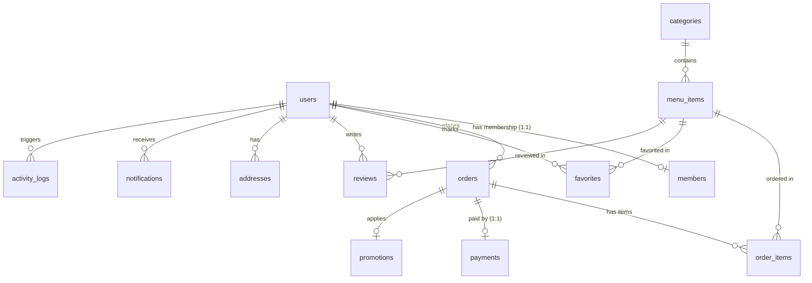

# PRODUCT REQUIREMENTS DOCUMENT (PRD) & DATABASE DESIGN
## ☕ COFFEE SHOP SYSTEM (REACT JS + SUPABASE + TAILWIND CSS)

Dokumen ini ditujukan sebagai acuan utama bagi **AI Coding Agent** untuk mengimplementasikan fitur Autentikasi, CRUD, Manajemen Poin & Tier Member, dan Riwayat Pesanan pada aplikasi Coffee Shop.

---

## 1. PENDAHULUAN & TUJUAN PROYEK

Aplikasi Coffee Shop ini dirancang untuk melayani tiga peran pengguna: **Admin**, **Member** (pelanggan terdaftar), dan **Guest** (pengunjung biasa). Tujuan utama fase ini adalah menyambungkan UI frontend yang sudah ada dengan backend **Supabase** menggunakan database relasional yang dinamis, menerapkan aturan otorisasi berbasis Row Level Security (RLS), serta mengaktifkan logika bisnis otomatis (seperti penomoran otomatis, akumulasi poin, upgrade level member otomatis, dan notifikasi).

---

## 2. SPESIFIKASI TEKNOLOGI & POLA KODE

*   **Frontend**: React JS (Vite), React Router DOM (v7), Tailwind CSS v4, Lucide React (Icons).
*   **Komponen UI**: Shadcn UI & CVA (Class Variance Authority).
*   **Backend**: Supabase (Database PostgreSQL + API client).
*   **State Management & Auth**: Autentikasi berbasis tabel kustom `public.users` dengan penyimpanan session di `localStorage` (untuk mempermudah pengembangan/pembelajaran CRUD kustom).
*   **Database Helper**: Terpusat pada file `src/lib/db.js` menggunakan instansi `@supabase/supabase-js` dari `src/lib/supabase.js`.

---

## 3. SPESIFIKASI FUNGSIONAL & ALIRAN PENGGUNA

### A. Autentikasi & Registrasi
*   **Registrasi (Register)**:
    *   Pengguna memasukkan: Nama Lengkap, Email, Password, Konfirmasi Password.
    *   Sistem melakukan pengecekan email unik di tabel `users`.
    *   Akun baru otomatis disimpan di tabel `users` dengan `role: 'customer'` dan `status: 'active'`.
*   **Login**:
    *   Pengguna memasukkan Email dan Password.
    *   Sistem mencari data pengguna yang cocok di tabel `users`.
    *   Jika cocok dan status akun `'active'`, simpan data pengguna lengkap ke dalam `localStorage` dengan key `"user"`.
    *   Arahkan pengguna ke halaman `/dashboard` untuk Admin atau `/member` untuk Customer/Member.

### B. Manajemen Peran (Role Management)
1.  **Admin (atau Cashier)**:
    *   Mengakses halaman `/dashboard`.
    *   Memiliki akses penuh untuk melihat statistik dashboard (penjualan, revenue, menu terlaris).
    *   Melakukan CRUD Menu & Kategori, CRUD Member/User, serta memperbarui Status Pesanan (`pending` ➔ `processing` ➔ `completed` / `cancelled`).
    *   Mengatur poin member secara manual (fitur adjustment/bonus).
2.  **Member (Customer Terdaftar)**:
    *   Mengakses halaman `/member` (dashboard khusus member).
    *   Dapat melihat informasi profil, kode barcode member (`MBR-XXXXX`), poin saat ini, serta level tier (`Bronze`, `Silver`, `Gold`, `Platinum`).
    *   Dapat melihat riwayat pesanan (order history) mereka sendiri beserta detail itemnya.
    *   Melakukan pemesanan makanan/minuman secara online, menerapkan voucher promo, mengumpulkan poin belanja, dan menukar poin dengan reward item gratis.
    *   Menerima notifikasi realtime tentang status pesanan, penambahan poin, atau kenaikan tingkat tier.
3.  **Guest (Pengunjung Biasa)**:
    *   Mengakses halaman `/` (Guest Shop).
    *   Dapat melihat menu yang tersedia dan melakukan checkout secara langsung.
    *   Saat checkout, wajib mengisi nama pelanggan (`customer_name`) dan nomor meja (`table_number`). Tidak mendapatkan poin atau benefit diskon member.

### C. Sistem Poin & Tier Membership
Sistem membership mendefinisikan 4 tingkatan tier secara otomatis berdasarkan akumulasi poin seumur hidup (`total_points`):

| Tier | Poin Minimum | Multiplier Poin | Diskon Otomatis | Warna Badge / Tema |
| :--- | :--- | :--- | :--- | :--- |
| **Bronze** | 0 pts | 1.0x | 0% | Perunggu (#CD7F32) |
| **Silver** | 500 pts | 1.5x | 5% | Perak (#C0C0C0) |
| **Gold** | 2000 pts | 2.0x | 10% | Emas (#FFD700) |
| **Platinum** | 5000 pts | 3.0x | 15% | Platinum (#E5E4E2) |

*   **Aturan Poin**: Belanja kelipatan mata uang tertentu menghasilkan poin dasar (contoh: setiap $1 atau Rp10.000 belanja mendapatkan 10 poin dasar, dikalikan dengan Multiplier Poin dari tier member saat ini).
*   **Otomasi Upgrade**: Saat transaksi order selesai (`status = 'completed'`), database trigger secara otomatis menambahkan poin ke profil member dan memeriksa apakah `total_points` mencukupi untuk naik ke tier berikutnya.
*   **Otomasi Notifikasi**: Jika tier naik, sistem secara otomatis menghasilkan baris baru di tabel `notifications` untuk memberi kabar bahagia kepada member.

---

## 4. DESAIN DATABASE RELASIONAL (SUPABASE SQL)

Desain ini menggunakan tabel `public.users` kustom yang terpisah dari skema `auth.users` internal Supabase agar CRUD dapat dipelajari dengan mudah tanpa batasan akses sistem.

### A. Tipe ENUM Kustom
```sql
CREATE TYPE user_role AS ENUM ('admin', 'cashier', 'customer');
CREATE TYPE user_status AS ENUM ('active', 'inactive', 'banned');
CREATE TYPE order_status AS ENUM ('pending', 'processing', 'completed', 'cancelled');
CREATE TYPE delivery_type AS ENUM ('dine_in', 'takeaway');
CREATE TYPE payment_method AS ENUM ('cash', 'card', 'e_wallet', 'qris');
CREATE TYPE payment_status AS ENUM ('pending', 'paid', 'refunded', 'failed');
CREATE TYPE discount_type AS ENUM ('percentage', 'fixed');
CREATE TYPE membership_status AS ENUM ('active', 'expired', 'suspended');
```

### B. Definis Tabel
Berikut adalah struktur tabel lengkap beserta konstrain relasionalnya:

```sql
-- 1. Tabel Users
CREATE TABLE users (
    id              UUID PRIMARY KEY DEFAULT gen_random_uuid(),
    name            TEXT            NOT NULL,
    email           TEXT            NOT NULL UNIQUE,
    password        TEXT            NOT NULL DEFAULT '123456', -- Disimpan aman / terenkripsi di produksi
    phone           TEXT,
    avatar_url      TEXT,
    role            user_role       NOT NULL DEFAULT 'customer',
    status          user_status     NOT NULL DEFAULT 'active',
    language        TEXT            NOT NULL DEFAULT 'id',
    timezone        TEXT            NOT NULL DEFAULT 'Asia/Jakarta',
    created_at      TIMESTAMPTZ     NOT NULL DEFAULT NOW(),
    updated_at      TIMESTAMPTZ     NOT NULL DEFAULT NOW()
);

-- 2. Tabel Kategori Menu
CREATE TABLE categories (
    id              SERIAL PRIMARY KEY,
    name            TEXT            NOT NULL,
    slug            TEXT            NOT NULL UNIQUE,
    description     TEXT,
    icon_url        TEXT,
    display_order   INT             NOT NULL DEFAULT 0,
    is_active       BOOLEAN         NOT NULL DEFAULT TRUE,
    created_at      TIMESTAMPTZ     NOT NULL DEFAULT NOW()
);

-- 3. Tabel Menu Item
CREATE TABLE menu_items (
    id              SERIAL PRIMARY KEY,
    category_id     INT             NOT NULL REFERENCES categories(id) ON DELETE RESTRICT,
    name            TEXT            NOT NULL,
    slug            TEXT            NOT NULL UNIQUE,
    description     TEXT,
    price           DECIMAL(10,2)   NOT NULL CHECK (price >= 0),
    image_url       TEXT,
    badge           TEXT,           -- Popular, Best Seller, New, Premium
    rating          DECIMAL(2,1)    NOT NULL DEFAULT 0.0 CHECK (rating >= 0 AND rating <= 5),
    review_count    INT             NOT NULL DEFAULT 0 CHECK (review_count >= 0),
    is_available    BOOLEAN         NOT NULL DEFAULT TRUE,
    display_order   INT             NOT NULL DEFAULT 0,
    created_at      TIMESTAMPTZ     NOT NULL DEFAULT NOW(),
    updated_at      TIMESTAMPTZ     NOT NULL DEFAULT NOW()
);

-- 4. Tabel Promosi (Voucher/Kupon)
CREATE TABLE promotions (
    id                  UUID PRIMARY KEY DEFAULT gen_random_uuid(),
    code                TEXT            NOT NULL UNIQUE,
    name                TEXT            NOT NULL,
    description         TEXT,
    discount_type       discount_type   NOT NULL DEFAULT 'percentage',
    discount_value      DECIMAL(10,2)   NOT NULL CHECK (discount_value >= 0),
    min_order_amount    DECIMAL(10,2)   NOT NULL DEFAULT 0,
    start_date          DATE            NOT NULL,
    end_date            DATE            NOT NULL,
    is_active           BOOLEAN         NOT NULL DEFAULT TRUE,
    max_uses            INT,
    current_uses        INT             NOT NULL DEFAULT 0,
    member_only         BOOLEAN         NOT NULL DEFAULT FALSE,
    min_tier            TEXT,           -- Bronze, Silver, Gold, Platinum
    created_at          TIMESTAMPTZ     NOT NULL DEFAULT NOW(),
    CONSTRAINT chk_promo_dates CHECK (end_date >= start_date)
);

-- 5. Tabel Orders
CREATE TABLE orders (
    id                  UUID PRIMARY KEY DEFAULT gen_random_uuid(),
    order_number        TEXT            NOT NULL UNIQUE,
    customer_id         UUID            REFERENCES users(id) ON DELETE SET NULL,
    customer_name       TEXT,           -- Digunakan jika pengunjung adalah Guest (checkout tanpa akun)
    status              order_status    NOT NULL DEFAULT 'pending',
    delivery_type       delivery_type   NOT NULL DEFAULT 'dine_in',
    table_number        TEXT,
    subtotal            DECIMAL(10,2)   NOT NULL DEFAULT 0 CHECK (subtotal >= 0),
    discount_amount     DECIMAL(10,2)   NOT NULL DEFAULT 0 CHECK (discount_amount >= 0),
    tax_amount          DECIMAL(10,2)   NOT NULL DEFAULT 0 CHECK (tax_amount >= 0),
    total_amount        DECIMAL(10,2)   NOT NULL DEFAULT 0 CHECK (total_amount >= 0),
    notes               TEXT,
    promotion_id        UUID            REFERENCES promotions(id) ON DELETE SET NULL,
    points_earned       INT             NOT NULL DEFAULT 0,
    points_redeemed     INT             NOT NULL DEFAULT 0,
    created_at          TIMESTAMPTZ     NOT NULL DEFAULT NOW(),
    updated_at          TIMESTAMPTZ     NOT NULL DEFAULT NOW()
);

-- 6. Tabel Item di dalam Order
CREATE TABLE order_items (
    id              SERIAL PRIMARY KEY,
    order_id        UUID            NOT NULL REFERENCES orders(id) ON DELETE CASCADE,
    menu_item_id    INT             REFERENCES menu_items(id) ON DELETE SET NULL,
    item_name       TEXT            NOT NULL,
    quantity        INT             NOT NULL CHECK (quantity > 0),
    unit_price      DECIMAL(10,2)   NOT NULL CHECK (unit_price >= 0),
    subtotal        DECIMAL(10,2)   NOT NULL CHECK (subtotal >= 0),
    notes           TEXT
);

-- 7. Tabel Pembayaran
CREATE TABLE payments (
    id                  UUID PRIMARY KEY DEFAULT gen_random_uuid(),
    order_id            UUID            NOT NULL REFERENCES orders(id) ON DELETE CASCADE,
    payment_method      payment_method  NOT NULL DEFAULT 'cash',
    amount              DECIMAL(10,2)   NOT NULL CHECK (amount >= 0),
    status              payment_status  NOT NULL DEFAULT 'pending',
    transaction_ref     TEXT,
    paid_at             TIMESTAMPTZ,
    created_at          TIMESTAMPTZ     NOT NULL DEFAULT NOW()
);

-- 8. Tabel Profil Member 🏆 (Relasi 1-to-1 dengan Users)
CREATE TABLE members (
    id              UUID PRIMARY KEY REFERENCES users(id) ON DELETE CASCADE,
    member_code     TEXT            NOT NULL UNIQUE, -- Auto: MBR-XXXXX
    tier            TEXT            NOT NULL DEFAULT 'Bronze',
    total_points    INT             NOT NULL DEFAULT 0 CHECK (total_points >= 0),
    current_points  INT             NOT NULL DEFAULT 0 CHECK (current_points >= 0),
    join_date       DATE            NOT NULL DEFAULT CURRENT_DATE,
    expired_date    DATE,
    status          membership_status NOT NULL DEFAULT 'active',
    created_at      TIMESTAMPTZ     NOT NULL DEFAULT NOW(),
    updated_at      TIMESTAMPTZ     NOT NULL DEFAULT NOW()
);

-- 9. Tabel Menu Favorit
CREATE TABLE favorites (
    id              SERIAL PRIMARY KEY,
    customer_id     UUID            NOT NULL REFERENCES users(id) ON DELETE CASCADE,
    menu_item_id    INT             NOT NULL REFERENCES menu_items(id) ON DELETE CASCADE,
    created_at      TIMESTAMPTZ     NOT NULL DEFAULT NOW(),
    CONSTRAINT uq_favorite UNIQUE (customer_id, menu_item_id)
);

-- 10. Tabel Review/Ulasan
CREATE TABLE reviews (
    id              UUID PRIMARY KEY DEFAULT gen_random_uuid(),
    customer_id     UUID            REFERENCES users(id) ON DELETE SET NULL,
    menu_item_id    INT             REFERENCES menu_items(id) ON DELETE SET NULL,
    customer_name   TEXT            NOT NULL,
    category        TEXT            NOT NULL DEFAULT 'Pelayanan',
    rating          INT             NOT NULL CHECK (rating >= 1 AND rating <= 5),
    comment         TEXT,
    is_approved     BOOLEAN         NOT NULL DEFAULT FALSE,
    created_at      TIMESTAMPTZ     NOT NULL DEFAULT NOW()
);

-- 11. Tabel Alamat (Opsional/Pengiriman)
CREATE TABLE addresses (
    id              UUID PRIMARY KEY DEFAULT gen_random_uuid(),
    customer_id     UUID            NOT NULL REFERENCES users(id) ON DELETE CASCADE,
    label           TEXT            NOT NULL DEFAULT 'Rumah',
    full_address    TEXT            NOT NULL,
    city            TEXT,
    postal_code     TEXT,
    latitude        DECIMAL(10,8),
    longitude       DECIMAL(11,8),
    is_default      BOOLEAN         NOT NULL DEFAULT FALSE,
    created_at      TIMESTAMPTZ     NOT NULL DEFAULT NOW()
);

-- 12. Tabel Notifikasi
CREATE TABLE notifications (
    id          UUID PRIMARY KEY DEFAULT gen_random_uuid(),
    user_id     UUID            NOT NULL REFERENCES users(id) ON DELETE CASCADE,
    title       TEXT            NOT NULL,
    message     TEXT            NOT NULL,
    type        TEXT            NOT NULL DEFAULT 'system',
    is_read     BOOLEAN         NOT NULL DEFAULT FALSE,
    data        JSONB           DEFAULT '{}'::JSONB,
    created_at  TIMESTAMPTZ     NOT NULL DEFAULT NOW()
);

-- 13. Tabel Konfigurasi Aplikasi
CREATE TABLE app_settings (
    id              SERIAL PRIMARY KEY,
    key             TEXT            NOT NULL UNIQUE,
    value           JSONB           NOT NULL DEFAULT '{}'::JSONB,
    description     TEXT,
    updated_by      UUID            REFERENCES users(id) ON DELETE SET NULL,
    updated_at      TIMESTAMPTZ     NOT NULL DEFAULT NOW()
);

-- 14. Tabel Log Aktivitas
CREATE TABLE activity_logs (
    id              UUID PRIMARY KEY DEFAULT gen_random_uuid(),
    user_id         UUID            REFERENCES users(id) ON DELETE SET NULL,
    action          TEXT            NOT NULL,
    entity_type     TEXT            NOT NULL,
    entity_id       TEXT,
    old_data        JSONB,
    new_data        JSONB,
    ip_address      INET,
    created_at      TIMESTAMPTZ     NOT NULL DEFAULT NOW()
);
```

### C. Indexes untuk Kinerja Query
```sql
CREATE INDEX idx_users_role ON users(role);
CREATE INDEX idx_users_email ON users(email);
CREATE INDEX idx_categories_slug ON categories(slug);
CREATE INDEX idx_menu_items_category ON menu_items(category_id);
CREATE INDEX idx_menu_items_slug ON menu_items(slug);
CREATE INDEX idx_orders_customer ON orders(customer_id);
CREATE INDEX idx_orders_status ON orders(status);
CREATE INDEX idx_orders_number ON orders(order_number);
CREATE INDEX idx_order_items_order ON order_items(order_id);
CREATE INDEX idx_payments_order ON payments(order_id);
CREATE INDEX idx_reviews_approved ON reviews(is_approved) WHERE is_approved = TRUE;
CREATE INDEX idx_favorites_customer ON favorites(customer_id);
CREATE INDEX idx_members_code ON members(member_code);
CREATE INDEX idx_members_tier ON members(tier);
CREATE INDEX idx_addresses_customer ON addresses(customer_id);
CREATE INDEX idx_notifications_unread ON notifications(user_id, is_read) WHERE is_read = FALSE;
```

---

## 5. DIAGRAM RELASI TABEL (ENTITY RELATIONSHIP)

Relasi antar-tabel diatur secara ketat menggunakan Foreign Key constraints untuk menjaga integritas data:



*   **users ➔ members**: Relasi 1-to-1 (`id` pada tabel `members` berelasi langsung ke `id` di tabel `users`). Menghapus user otomatis menghapus keanggotaannya (`ON DELETE CASCADE`).
*   **categories ➔ menu_items**: Relasi 1-to-many. Mencegah penghapusan kategori jika masih memiliki item menu aktif (`ON DELETE RESTRICT`).
*   **orders ➔ order_items**: Relasi 1-to-many. Menghapus pesanan otomatis menghapus detail item pesanan tersebut (`ON DELETE CASCADE`).
*   **orders ➔ payments**: Relasi 1-to-1. Setiap pesanan tepat memiliki satu data transaksi pembayaran.

---

## 6. LOGIKA OTOMASI DATABASE (PL/pgSQL FUNCTIONS & TRIGGERS)

Guna mengurangi beban pemrosesan di sisi frontend React, logika bisnis penting dipindahkan secara otomatis ke dalam database menggunakan trigger PostgreSQL.

### A. Penomoran Otomatis Order (`ORD-001`, `ORD-002`, ...)
```sql
CREATE OR REPLACE FUNCTION fn_generate_order_number()
RETURNS TRIGGER AS $$
DECLARE
    next_num INT;
BEGIN
    SELECT COALESCE(MAX(CAST(REPLACE(order_number, 'ORD-', '') AS INT)), 0) + 1 
    INTO next_num FROM orders;
    
    NEW.order_number = 'ORD-' || LPAD(next_num::TEXT, 3, '0');
    RETURN NEW;
END;
$$ LANGUAGE plpgsql;

CREATE TRIGGER trg_order_number BEFORE INSERT ON orders FOR EACH ROW 
WHEN (NEW.order_number IS NULL OR NEW.order_number = '') 
EXECUTE FUNCTION fn_generate_order_number();
```

### B. Pembuatan Kode Member Otomatis (`MBR-00001`, `MBR-00002`, ...)
```sql
CREATE OR REPLACE FUNCTION fn_generate_member_code()
RETURNS TRIGGER AS $$
DECLARE
    next_num INT;
BEGIN
    SELECT COALESCE(MAX(CAST(REPLACE(member_code, 'MBR-', '') AS INT)), 0) + 1 INTO next_num FROM members;
    NEW.member_code = 'MBR-' || LPAD(next_num::TEXT, 5, '0');
    RETURN NEW;
END;
$$ LANGUAGE plpgsql;

CREATE TRIGGER trg_member_code BEFORE INSERT ON members FOR EACH ROW 
WHEN (NEW.member_code IS NULL OR NEW.member_code = '') 
EXECUTE FUNCTION fn_generate_member_code();
```

### C. Upgrade Tingkat Member Otomatis berdasarkan Akumulasi Poin
Fungsi ini dipicu sesaat sebelum data poin member berubah di tabel `members`.
```sql
CREATE OR REPLACE FUNCTION fn_check_tier_upgrade()
RETURNS TRIGGER AS $$
BEGIN
    IF NEW.total_points >= 5000 THEN
        NEW.tier = 'Platinum';
    ELSIF NEW.total_points >= 2000 THEN
        NEW.tier = 'Gold';
    ELSIF NEW.total_points >= 500 THEN
        NEW.tier = 'Silver';
    ELSE
        NEW.tier = 'Bronze';
    END IF;
    RETURN NEW;
END;
$$ LANGUAGE plpgsql;

CREATE TRIGGER trg_check_tier_upgrade BEFORE UPDATE ON members FOR EACH ROW 
WHEN (NEW.total_points != OLD.total_points) 
EXECUTE FUNCTION fn_check_tier_upgrade();
```

### D. Otomasi Notifikasi Naik Tier & Transaksi Poin
Sistem mengirimkan notifikasi ke tabel `notifications` ketika tier member berubah atau poin masuk/keluar.
```sql
CREATE OR REPLACE FUNCTION fn_notify_tier_upgrade()
RETURNS TRIGGER AS $$
BEGIN
    INSERT INTO notifications (user_id, title, message, type)
    VALUES (
        NEW.id,
        'Selamat! Level Membership Naik 🎉',
        'Membership Anda telah naik dari ' || OLD.tier || ' ke level ' || NEW.tier || '. Nikmati benefit diskon terbarunya!',
        'membership'
    );
    RETURN NEW;
END;
$$ LANGUAGE plpgsql;

CREATE TRIGGER trg_notify_tier_upgrade AFTER UPDATE ON members FOR EACH ROW
WHEN (NEW.tier IS DISTINCT FROM OLD.tier)
EXECUTE FUNCTION fn_notify_tier_upgrade();
```

---

## 7. ATURAN AKSES DATA (ROW LEVEL SECURITY - RLS)

Supabase menggunakan PostgreSQL Row Level Security (RLS) untuk membatasi akses data. Kita membagi kebijakan RLS ke dalam dua opsi berdasarkan kompleksitas pengerjaan:

### OPSI A: RLS Mode Pembelajaran (Development Bypass)
Untuk mempermudah debugging frontend tanpa halangan otentikasi JWT Supabase, aktifkan RLS tetapi izinkan seluruh operasi CRUD secara publik (`USING (TRUE) WITH CHECK (TRUE)`).

*Contoh Penerapan:*
```sql
ALTER TABLE users ENABLE ROW LEVEL SECURITY;
CREATE POLICY "Allow public CRUD on users" ON users FOR ALL USING (TRUE) WITH CHECK (TRUE);
```
*(Lakukan hal yang sama untuk ke-13 tabel lainnya seperti yang tertera di file `supabase_schema.sql`).*

### OPSI B: RLS Mode Produksi (Role-Based Access)
Di lingkungan produksi, hak akses dibatasi ketat berdasarkan Peran (`users.role`) dan ID Pengguna (`users.id`).

1.  **Tabel `users`**:
    *   **Select**: Pengguna dapat melihat data mereka sendiri (`id = auth.uid()`), Admin dapat melihat semua data.
    *   **Update**: Pengguna hanya dapat memperbarui profil mereka sendiri. Admin dapat memperbarui semua.
    *   **Insert**: Terbuka secara publik (untuk fitur Registrasi akun baru).
2.  **Tabel `menu_items` & `categories`**:
    *   **Select**: Terbuka secara publik untuk semua pengunjung (Guest & Member).
    *   **Insert/Update/Delete**: Hanya diizinkan bagi pengguna dengan peran `'admin'`.
3.  **Tabel `orders` & `order_items`**:
    *   **Select**: Member hanya dapat melihat riwayat order mereka sendiri (`customer_id = auth.uid()`). Admin/Kasir dapat melihat seluruh order.
    *   **Insert**: Diizinkan bagi semua pengguna (Guest dapat mengorder dengan `customer_id` kosong).
4.  **Tabel `members` & `notifications`**:
    *   **Select/Update**: Terbatas untuk pemilik profil (`id = auth.uid()`) dan Admin.

---

## 8. RENCANA IMPLEMENTASI BERTAHAP (STEP-BY-STEP PLAN)

AI Coding Agent harus mengikuti langkah-langkah terstruktur ini untuk mengimplementasikan fitur:

### 📍 TAHAP 1: Inisialisasi Database Supabase
1.  Buka **Supabase SQL Editor**.
2.  Salin seluruh kode dari file `src/database/supabase_schema.sql` dan jalankan.
3.  Pastikan 14 tabel, indexes, trigger, views, serta data benih (seed data) berhasil dibuat tanpa error.

### 📍 TAHAP 2: Hubungkan Client Supabase & Buat Session Auth
1.  Buka file `src/lib/supabase.js` dan pastikan environment variable `VITE_SUPABASE_URL` and `VITE_SUPABASE_ANON_KEY` dimuat dengan benar dari file `.env`.
2.  Pasang middleware atau logic check pada `src/App.jsx` untuk membaca session dari `localStorage.getItem("user")`.
3.  Sesuaikan halaman `src/pages/auth/Login.jsx` dan `Register.jsx` agar membaca/menulis ke database Supabase secara real (bukan data tiruan).

### 📍 TAHAP 3: Implementasi CRUD Sisi Admin
1.  **CRUD Produk (`src/pages/admin/Menu.jsx`)**: Sambungkan form edit, tambah, dan hapus ke tabel `menu_items` & `categories`.
2.  **CRUD Member (`src/pages/admin/Members.jsx`)**: Hubungkan tabel `users` dengan peran `'customer'` dan pastikan integrasi poin member (fitur adjust points) memanggil fungsi `createPointTransaction` di `db.js`.
3.  **CRUD Order (`src/pages/admin/Orders.jsx`)**: Tampilkan seluruh pesanan masuk dengan men-query view `v_order_details`. Aktifkan tombol update status pesanan.

### 📍 TAHAP 4: Implementasi Checkout Pesanan (Guest & Member)
1.  **Guest Checkout (`src/pages/guest/GuestShop.jsx`)**: Pastikan keranjang belanja dapat melakukan checkout dengan mengirimkan `orderPayload` ke function `createOrder` di `db.js` (dengan `customer_id` diisi `null` dan `customer_name` diisi nama inputan manual).
2.  **Member Checkout (`src/pages/member/MemberShop.jsx`)**:
    *   Ambil profil member aktif. Hitung diskon otomatis berdasarkan tier (contoh: Silver diskon 5%).
    *   Izinkan input kode voucher promo dan validasikan langsung ke tabel `promotions`.
    *   Saat order selesai dibuat, panggil trigger penambahan poin di backend.

### 📍 TAHAP 5: Implementasi Dasbor Member & Riwayat Poin
1.  Hubungkan dasbor member (`MemberShop.jsx` tab profil/rewards) ke view `v_member_details`.
2.  Tampilkan daftar notifikasi aktif yang belum dibaca dari tabel `notifications` dan tampilkan indikator bell badge.
3.  Tampilkan log transaksi poin member dengan melakukan query ke tabel `activity_logs` yang terfilter berdasarkan `user_id`.
